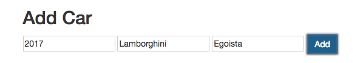
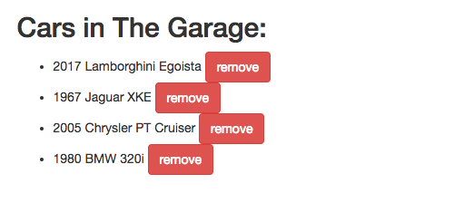
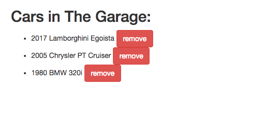
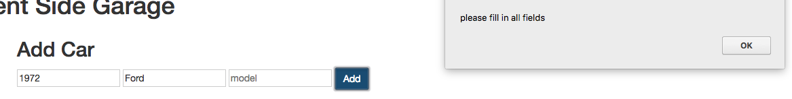

Client Side Garage
===

Welcome to your second Code Challenge! You'll be creating a small application that will track cars in a garage. The "garage" will be an array on the. 

You'll be using the following technologies:

- ES6 Javascript
- JQuery
- Bootstrap CSS

The Car class:
---

each car should have the following fields:

- year
- make
- model

User Input
---

You'll need to create an interface that will allow the user to input a car's info. Then the user can click "Add" that will add the car to an array.

Garage Display
---

There needs to be a space on the page where all the cars in the garage are displayed. This list should be updated whenever a car is added to the garage.

Empty the input fields after a car has been added.

Add a working remove button for each car

Only allow cars to be added if all input fields are filled in.

Styling
---

Use Bootstrap so it isn't ugly.